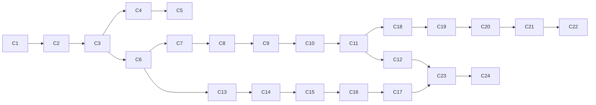

# Chapter dependency map

```mermaid
flowchart LR
  C1 --> C2 --> C3 --> C4 --> C5
  C3 --> C6 --> C7 --> C8 --> C9 --> C10 --> C11 --> C12
  C6 --> C13 --> C14 --> C15 --> C16 --> C17
  C11 --> C18 --> C19 --> C20 --> C21 --> C22
  C12 --> C23
  C17 --> C23 --> C24
```

The linear reading path is supported, while experienced analysts may enter at Chapter 13 and follow the operational chain with cross-references to Chapters 6–12.
